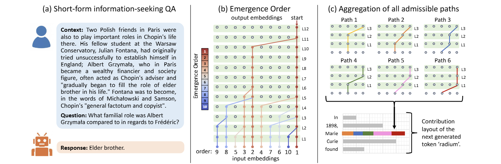

# Information Flow Reveals When to Trust Language Models
This is the source code for the paper [Information Flow Reveals When to Trust Language Models](https://icml.cc/virtual/2026/poster/60884).

**(a)** An example of a short-form, information-seeking QA. **(b)** Principal information flow is extracted in reverse from the model's complete information flow. The resulting Emergence Order records the sequence of input tokens added to this principal flow, with earlier tokens indicating greater importance for the final generation. For clarity, we neglect MLP operations as they operate independently on each token. **(c)** The contribution of each input token to the next generated token is defined as the sum of all valid paths from itself to the last input token embedding in the final layer.  Contribution Layout represents the contributions of all input tokens.

## Environments

## Models
Our experiments use Meta’s LLaMA-3.2-3B-Instruct, LLaMA-3-8B-Instruct, and Gemma-3-4B-it as the base inference language models. We combine each question with both the predicted answer and the ground-truth answer to construct two natural-language statements using Qwen2.5-7B. The generated prediction statement is subsequently evaluated with HHEM-2.1-Open. In addition, Qwen3-Reranker-8B, MiniLM-L12-v2, and BGE-v2-m3 are employed as ranking models to assign relevance scores to contextual passages.

You can download the models locally and replace the keyword `"MODEL_PATH_PLACEHOLDER"` in our scripts with the corresponding local model paths.
## Code

1. The `preprocessed_data` folder contains preprocessed versions of the SQuAD2.0, HotpotQA, and MS MARCO datasets, formatted to be compatible with our codebase.

2. The `proposed` folder contains the implementation of our proposed framework, including:

&nbsp;&nbsp;&nbsp;&nbsp;&nbsp;&nbsp;&nbsp;&nbsp;(1). **Prediction Generation and Evaluation**. Modules for producing answers with language models and assessing prediction correctness.

&nbsp;&nbsp;&nbsp;&nbsp;&nbsp;&nbsp;&nbsp;&nbsp;(2). **Relevance Analysis**. Utilities for computing Shapley values to measure the relevance of individual context tokens to question answering.

&nbsp;&nbsp;&nbsp;&nbsp;&nbsp;&nbsp;&nbsp;&nbsp;(2). **Contribution Analysis**. Scripts for using information flow to track each context token's contribution to the prediction.

&nbsp;&nbsp;&nbsp;&nbsp;&nbsp;&nbsp;&nbsp;&nbsp;(3). **Information-Flow-Based Uncertainty Estimation**. Components for estimating predictive uncertainty via the measured contribution and relevance.

3. The `baselines` folder provides implementations of representative baseline approaches, including:

&nbsp;&nbsp;&nbsp;&nbsp;&nbsp;&nbsp;&nbsp;&nbsp;(1). **Data Preparation for Baselines**. Utilities for constructing training, validation, and test splits used in baseline experiments.

&nbsp;&nbsp;&nbsp;&nbsp;&nbsp;&nbsp;&nbsp;&nbsp;(2). **Baseline Uncertainty Quantification Methods**. Scripts for reproducing and evaluating baseline uncertainty quantification (UQ) techniques.

4. The `evaluation` folder contains scripts for summarizing the main experimental results and conducting ablation studies.
